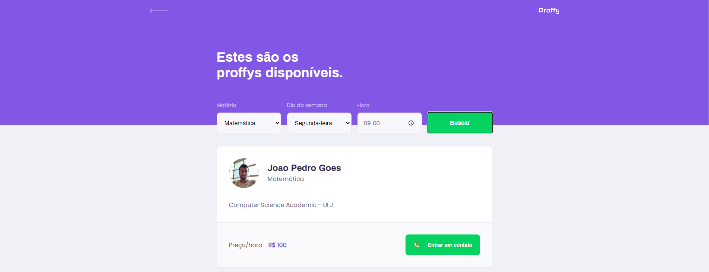

   

 

## 📝 Sumário 

- Layout da aplicação

- Tecnologias

- Funcionalidades

- Como rodar

## 📥 Layout da aplicação

O layout da aplicação foi desenvolvido pela equipe da <b>@Rocketseat</b>.

   <b>Versão Web</b>
   
 

   
   

   <b>Versão Mobile</b>
   
 

   

      
      
      
      
   

 

## 🔑 Tecnologias

 

## 🔨 Funcionalidades

 

## 🔰 Como rodar

 

